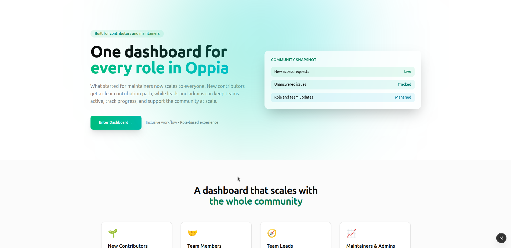
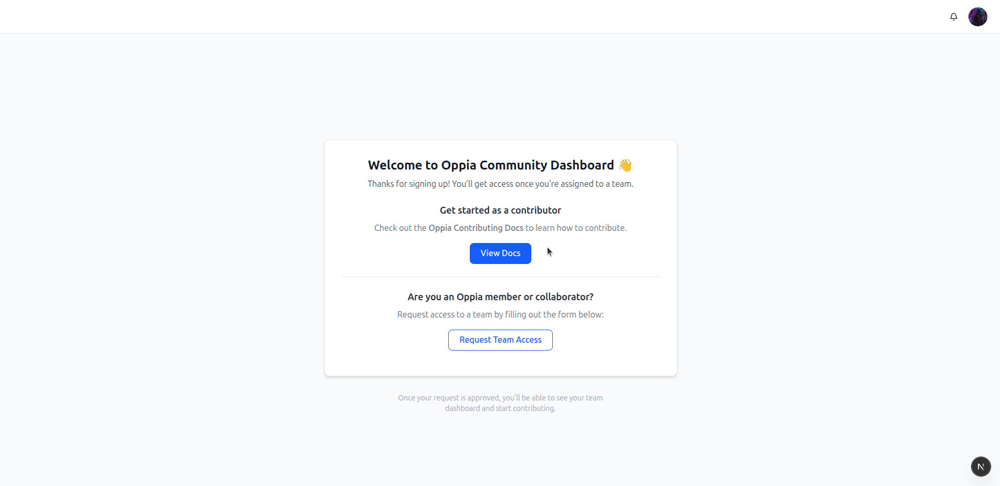
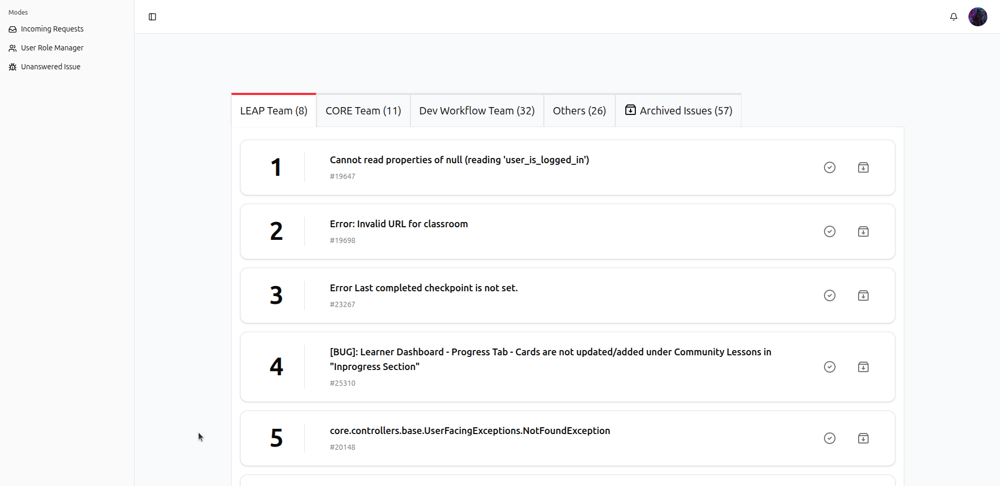
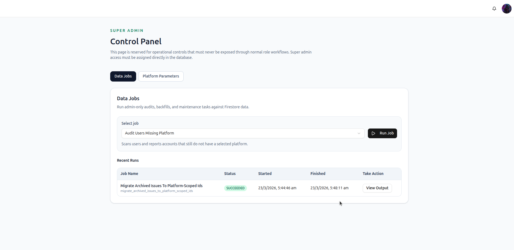

# Oppia Community Dashboard

The Oppia Community Dashboard is a role-based operations dashboard for the Oppia contributor community. It helps contributors, team members, team leads, and admins coordinate access, manage unanswered issues, track community workflow, and keep contributor operations organized in one place.

### 🔥 Features

This project is designed to support the full lifecycle of community contribution:

- onboarding new contributors
- routing contributors to the right teams
- reviewing and managing access requests
- tracking unanswered GitHub issues
- managing contributor roles and team assignments

The dashboard is built primarily for Oppia maintainers and community operators, while still giving contributors a structured path into the system.

### 🏗️ Project Structure

Key directories:

- [`app/`](/home/hardik/oppia-leads-dashboard/app) – route entry points
- [`features/`](/home/hardik/oppia-leads-dashboard/features) – feature-specific UI and workflows
- [`components/`](/home/hardik/oppia-leads-dashboard/components) – shared layout and UI components
- [`db/`](/home/hardik/oppia-leads-dashboard/db) – Firestore access layer
- [`lib/`](/home/hardik/oppia-leads-dashboard/lib) – domain types, auth, constants, utilities, services

### ⚡ Live Deployment

Try the live app here:

- [Oppia Community Dashboard](oppia-community-dashboard.vercel.app)

If you find this project helpful, please consider starring the repository, as it makes the project easier to discover: 🌟[Star this repository](https://github.com/HardikGoyal2003/Oppia-Leads-Dashboard)

### 🤝 Contributing

If you want to suggest improvements or report bugs, please use the GitHub issue tracker:

- [File a bug or feature request](https://github.com/HardikGoyal2003/Oppia-Leads-Dashboard/issues)

### 🙌 Reach Out

If you want to connect, share feedback, or discuss the project:

- GitHub: [@HardikGoyal2003](https://github.com/HardikGoyal2003)
- LinkedIn: [hardikgoyal2003](https://www.linkedin.com/in/hardikgoyal2003)

### 📄 License

This repository is licensed under the Apache License 2.0. See [LICENSE](LICENSE).
